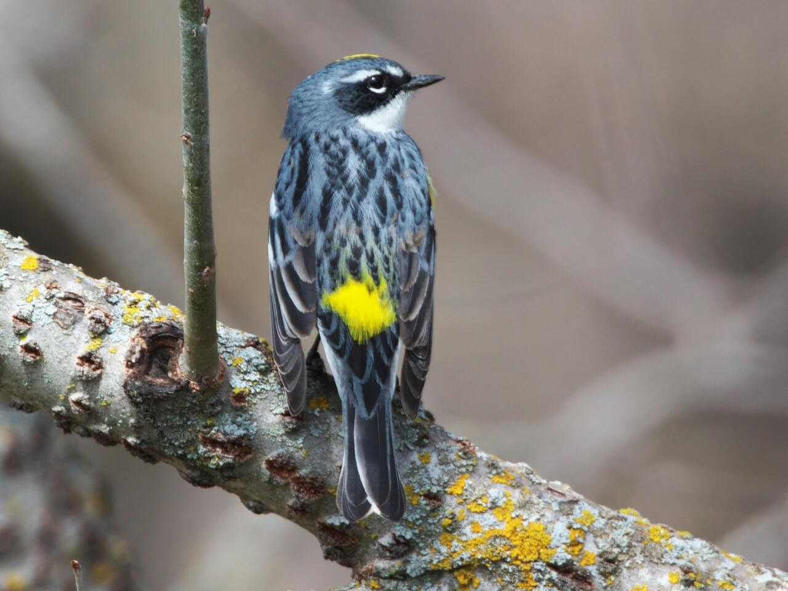
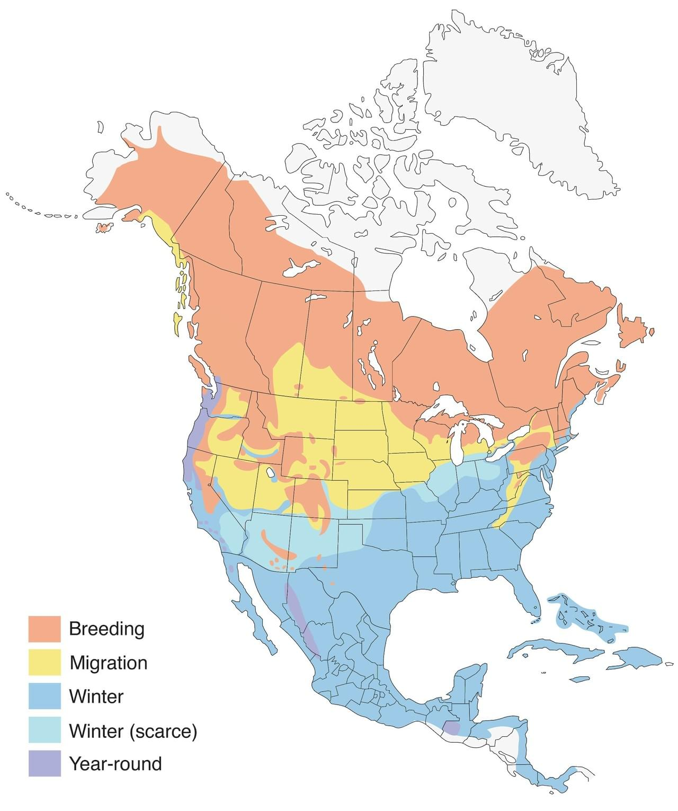

<base target="_blank"/>

***

```{r setup, include=FALSE}
knitr::opts_chunk$set(echo = TRUE, message = FALSE)
```
# Introduction

Welcome to Part 1 of our eBird dataset tutorial! Part 2 applies the basic exploratory data analysis lessons learned in this tutorial to some real-world analysis of hurricanes' effects on birds in North Carolina. To access data files and scripts for this tutorial, visit https://github.com/margaret-swift/eBirdEDA. 

Exploratory Data Analysis, or EDA, is a catch-all term that means "looking at the data you've got before starting on your analysis." Just like you might read the back cover, flip through the pages, and admire the cover of a book before diving into the story, we do the same thing with data. This can be as simple as looking at a data table, or as complicated as plotting data points on a map. We cover the basics here.

EDA is really important for data analysis. You have to know what's going on with your data before you can begin to analyze it. It can save you a lot of headaches in the future, too, by finding incorrect data points, or bizarre data trends due to incorrect data types. In my experience, I've discovered missing and duplicate data points, flipped latitude-longitude locations, and data that was just *wrong*, all from performing EDA. I hope this tutorial will help you appreciate EDA and begin to be comfortable with the basic tools of the trade.

# Setting up

Before we start our EDA, we have to set up our workspace and load our data.

### Cleaning up your workspace

The first thing I like to do when setting up R is to remove everything from my environment. That way we start things fresh and clean. Run this chunk of code to clear out your environment.

```{r cleanupWS}
rm(list=ls())
```

Next, we have to load a few 'libraries' into our current project. Libraries are like expansion packs for R---these are loaded on top of "base R", which includes basic functions like `plot()` and `sum()` and `mean()`. 

If you haven't already, you need to run this first line, `install.packages('pacman')` to get `pacman` from the Internet to your computer. 
```{r installPacman, eval=F}
install.packages('pacman') #only run this once ever!
```

Then you can use its function `p_load()` to load everything else. We use the `::` to use a package without loading it. It's also useful for remembering which package a certain function comes from

```{r loadLibraries}
pacman::p_load(dplyr, lubridate, knitr, #for data wrangling and handling dates, respectively
               sf, mapproj, maps, rnaturalearth, rnaturalearthdata, usmap, #map
               ggplot2, scales, viridis) #for nice plotting
```

The last bit of set-up: Make sure R knows where you want it to look for files!  This is called your 'working directory' (`wd`). Mine are stored in a folder called 'ebirdGIT', but yours might be somewhere different. Copy and paste the file path of your data folder into this chunk and run it (make sure the slashes / are going the correct way!).

```{r setWD, eval=F}
setwd("~/Documents/ebirdGIT")
```

### Loading your data

The data we're going to be working with today is from [eBird](https://ebird.org/about). eBird is a community-based platform launched in 2002 where anyone can create an account and log the birds they see. Every time someone goes out on a walk or sits on their back porch, they'll create a 'checklist' for that activity, recording the species and number of birds they see. [Visit this link](https://ebird.org/science) for more information about how scientists use eBird data in their research projects. 

eBird is an extremely popular platform with a LOT of data (we're talking gigabytes here); this would take you a very long time to download and use. Luckily, Lane has already done the hard part for you. We'll just be working with a small portion: part of hurricane season (August 15-October 15) data for birds sighted across North Carolina from 2017 to 2019. Visit our Part 0 tutorial for more information on how we downloaded and parsed these eBird data.

To load the data for today's lecture, **make sure you've got the 'data.rdata' file downloaded** into the same working directory you defined in the setup section, then run these lines of code:

```{r loadingNC}
load("../data/data.rdata") #change this to match your file path
data <- allData[[2]] #this second object contains our North Carolina data.
```

Now, we're going to be making a few maps today, so we'll need to load those as well. These come from the libraries you loaded earlier, so there's no need to download any new files. We're just going to use cities in North Carolina with over a million residents, so the last line filters the us.cities dataset to just those parameters.

```{r maps}
states <- map("state", plot = FALSE, fill = TRUE) #get state data
data(us.cities) #get city data
cities <- filter(us.cities, country.etc == "NC", pop > 2e5) #clean up city data
```

Finally, before we get started, I always like to save a copy of our original dataset, so if we make changes we can always go back or compare.

```{r savingData}
originalData <- data
```


# Basic Exploratory Data Analysis

### Viewing your data

A lot of you might be used to spreadsheet products like Google Sheets and Excel; you can view datasets in R the exact same way! Either go to your 'Environment' tab or use the function `View()` to see what's inside our dataset. Be careful using View() on large datasets, though; like Excel, anything more than a few million data points will start to really slow things down. Let's check how big our dataset is first, just to be sure.

```{r dimData}
dim(data)
```

`dim()` shows the number of rows, then the number of columns. Great, only about 6 million rows. In the realm of Big Data, this is not actually too much of a problem.

For part of this analysis, we'll have to grab the months from all of the dates in `observation_date`. Let's do that now; this is easily done by using the `month()` function from the `lubridate` package. We're also going to make `month` a "factor"; factors are like categories, and later on we might want to display things by category. 

```{r addingMonth}
data$month <- month(data$observation_date)
data$month <- as.factor( data$month ) 
```

<span style="color:purple">**On your own:**</span> Try using functions like `year()` or `month()` on today's date (`today()`) or other days (`as.Date('2021-03-30')`. What does the function `yday()` do? What about `wday()`?

<span style="color:purple">**On your own:**</span> Use `View()` in your own console; it won't show up properly on this HTML document. Make sure to click around and explore the filter, sort, and search functions. Compare `originalData` to `data` after the changes we made in this section.

### Extracting unique values from a group

The first question you might ask of this dataset is, <span style="color:blue">*What species are represented?*</span> To find out, we use the function `unique()`. It's going to be a long list, so I use `head()` to just look at the top few. `length()` tells us how many species there are.

```{r numSpecies}
species <- unique( data$scientific_name )
head(species, 20)
length(species)
```

`r length(species)` species just in North Carolina! Not too shabby. 

<span style="color:purple">**On your own:**</span> There are a few other similar functions you can try on your own: `tail()`, `str()`, and `summary()`. Try them out on this dataset.

### Investigating data's temporal spread

Our next question: <span style="color:blue">*When were these data recorded?*</span> Let's use `table()` to summarize the number of checklists per year. First, we'll have to create a smaller table of just all the checklist IDs and the year and month they were created in; otherwise, we'll have `r length(species)` rows for each checklist. We're going to use the function `group_by` to call out the data we want, and then `summarize` to collapse the dataset into each of the unique checklists. Both of these functions come from the `dplyr` package, which we've already loaded in.

```{r checklists}
checklists <- group_by( data, checklist_id, year, month, observation_date )
checklists <- summarize( checklists )
head(checklists)
```

Now that we have our `checklists` object, let's plot the number of checklists per year.
```{r yearlyChecklists}
( checklists.yearly <- table(checklists$year) )
barplot(checklists.yearly, col='purple', lwd=3, ylab='count', xlab='year')
```

Interesting---you can see that the number of observations is growing over time. Why might this be? (Hint: remember that this is the *number of observations* made on a social community science platform, which is increasing in usership over time.)

<span style="color:purple">**On your own:**</span> Try changing the code in the above chunk to find out what the parameters `col`, `lwd`, `xlab` and `ylab` do. Use the `?barplot()` function in the console to figure out how to add a title.

Now, let's see how the data are spread out across months, using the same code as the yearly data but with `checklists$month` instead of `checklists$year`:

```{r monthlyChecklists}
( checklists.monthly <- table(checklists$month) )
barplot(checklists.monthly, col='blue', lwd=3, ylab='count', xlab='month')
```

<span style="color:purple">**On your own:**</span> It looks like there are a lot more observations on eBird during September than August or October. Why might that be? (Hint: use the `summary` function to investigate the spread of the `observation_date` column.)

From these two plots alone, you can see why it's important to do our EDA. We have already learned that the number of observations is increasing every year, and that there is more data in September than in August or October. This is not a problem, but it is an important thing to know about our dataset.


### Presence and absence

Let's try a harder question this time: <span style="color:blue">*Which birds are most common across North Carolina for this time period?*</span> One way to answer this question is to find out how many checklists contain each species, then sort from largest to smallest. 

Because there is a difference between "I never went there, therefore I didn't see any cardinals" and "I went there, and didn't see any cardinals", it is useful to account for checklists that *don't* have a certain species. All those zeroes, however, will mess up our frequency analysis so far; every species will be 'present' in every checklist, even if their 'presence' is at zero abundance. 

To deal with this, we'll make a temporary subset of our data that ignores these zeroes, using two different methods. The first is to find all the rows with '0' for that species and remove them. The second uses the `filter` function. Both are perfectly acceptable methods, and depend on your preference.

```{r filterZeroes}
# method 1: find all rows with 0 for observation_count and remove them
inx <- which( data$observation_count == 0 )
sub.data <- data[ -inx, ]

# method 2: use the filter function
sub.data <- filter(data, observation_count != 0)
```

The next step will be to summarize the number of times each species appears in this dataset. `table()` works quite nicely for this. We'll save that information as a variable named `freq`, `sort()` it in descending order, then use `head()` to look at the top ten.

```{r sortCommon}
freq <- table(sub.data$scientific_name)
freq_sorted <- as.data.frame( sort(freq, decreasing=T) )

names(freq_sorted) <- c('Species', 'Frequency')
head(freq_sorted, 10)
```

Quite appropriately, our top contenders are *Thryothorus ludovicianus*, the Carolina wren, closely followed by our state bird, *Cardinalis cardinalis*, and the Carolina chickadee, *Poecile carolinensis*.

I mentioned that this was just *one* way to calculate commonality. What other methods might you use to find the most common birds? What kinds of biases are inherent in the method I introduced above? We'll cover this in the next section.


### Count data

So far we have been really just looking at the number of data points. In ecological data, this is called "presence-absence": data that just says whether a species was seen or not. In our data, we have a column labeled "observation_count". What is this for?
```{r obsCounts}
head(data$observation_count, 10)
```

These are the *number of birds* reported by species for each checklist; if I saw three cardinals on my morning walk, *Cardinalis cardinalis* would have a `3` in the `observation_count` column. This is called "count" data, which can be more useful than presence-absence as it allows us to ask questions like "how many individuals were seen?" instead of merely "was the species there at all?"

Before moving onto the count data questions, we have to deal with a common data feature of eBird data: sometimes, there are too many birds for someone to count. When this happens, their data has an "X" logged in the `observation_count` column. <span style="color:blue">*How do we deal with these non-numeric values?*</span>

Since we don't really have ideas for a number that X could stand for, let's just ignore those checklists. For this, we're going to create a function called `removeX()`. Writing functions is useful if we think we may want to do the same thing to other datasets in the future; removing all the X's seems handy if you're working with a lot of eBird data. Function syntax looks like this:

```{r functionSyntax, eval=F}
functionName <- function( parameters, go, here ) {
  # here is where you would put all the function pieces; usually you take
  # the parameters, change them around, and then give them back.
  
  # at the end, put a 'return' statement to give the user back
  # the finished product
  return( thingYouWantBack )
}
```

So, here's our function to remove any checklist that has an X in it.
```{r removeX}
removeX <- function( df ) { #we only have one parameter this time
  # this line finds all rows with an X in observation_count
  removeXdf <- df[ df$observation_count == "X", ]
  
  # this line gives us all the unique checklists with any X in observation_count
  toRemove <- unique(as.character(removeXdf$checklist_id))
  
  # this part is just making sure that 'toRemove' is not an empty list
  if ( length(toRemove) > 0 ) {
    # now we remove all the checklists that are in that toRemove list.
    df <- df[ !(df$checklist_id %in% toRemove), ]
  }
  
  # now make sure observation_count is a number
  df$observation_count <- as.numeric( df$observation_count )
  
  # here's that return function where you hand 'df' back to the user.
  return(df)
}

data <- removeX(data)
# try using head() and summarize() to look at the differences.

```

Now that we've removed all the X's, you can see that another way to measure commonality is to count up all the *observed number* of birds of each species. This is slightly different than what we did before, which was to count the *number of checklists* in which a species appeared. This introduces bias in that a solitary cardinal and a flock of starlings will only count as one each. Let's account for this, using our old friend `group_by`:

```{r commonalityPart2}
species.data <- group_by( data, scientific_name )
species.data <- summarize( species.data, n = sum(observation_count))
species.data <- species.data[order(species.data$n, decreasing = T),] #sorting by n

names(species.data) <- c('Species', 'Frequency')
head(species.data, 10)
```
Ah, we see a difference here. We see our composition of common birds has shifted to favor species that travel in large flocks, like *Branta canadensis* (Canada goose) or *Leucophaeus atricilla* (laughing gull). There is nothing right or wrong with either of our measures of commonality, but you can see that the two are very different. An important facet of EDA is deciding (and carefully defining) what you are trying to show.


# Exploratory Data Analysis: Plotting

For this section, we're going to look at data for a single species: the [yellow-rumped warbler](https://www.allaboutbirds.org/guide/Yellow-rumped_Warbler/overview) (*Setophaga coronata*). 



The yellow-rumped warbler is a small gray bird with bright yellow patches. It spends its breeding season up in Canada, but migrates down to the southern US (including North Carolina) for the winter. Keep an eye out for this migration pattern as we work through the eBird dataset!



First, we'll create a new data frame that is just yellow-rumped warblers. Then, to make things simpler, we're just going to focus on 2018 data for now.

```{r setoCoroSubset}
seto.coro <- data[ data$scientific_name == "Setophaga coronata", ]
seto.coro.2018 <- seto.coro[ seto.coro$year == 2018, ]
```

<span style="color:purple">**On your own:**</span> Try using `View()`, `head()`, and `dim()` to look at our new, smaller dataset.

We're going to use a library called `ggplot2` for the following graphs. This is just another way to plot things in R, and is a commonly-used library for all sorts of graphs. They usually come out quite pretty. The syntax looks like this ([here's a cheat sheet](https://rstudio.com/wp-content/uploads/2016/11/ggplot2-cheatsheet-2.1.pdf), if you like):

```{r ggplotSyntax, eval=F}
ggplot(dataSetName, #whatever data you want to plot goes here
       aes(x=xColName, y=yColName, color=colorColName, fill=fillColName)) +
  ggfunction( params=params ) + #plots usually have special parameters
  xlab(xAxisLabel) + 
  ylab(yAxisLabel) + 
  ggtitle(titleLabel) +
  ...
  # there are lots of other things you can do, like themes and color schemes.
```

Unlike normal R functions, you use plus signs `+` to add new features to your graph. Below are a few examples to get a hang of things. 

For these plots, our x and y axes are going to be the same throughout, so let's set them now. Similarly, we want all our plots to have a text size of 18 and title size of 20, for easier readability.

```{r plotDefaults}
xlab <- "observation date"
ylab <- "number of observations"
plot.theme <- theme( text = element_text(size=18), title = element_text(size=20) )
```


### Presence over time

The first plot will be a simple histogram for checklists across August-October of 2018, counting up the number of checklists that include *Setophaga coronata* in its observations. `geom_histogram()` is used to make bar graphs and histograms; in this case, we are using `observation_date` as the x-axis. Then we have the title, axis labels, and plot theme created above. Remember that we have to remove the rows with '0' if we just want to show checklists that included our warbler.

```{r warbsAbundPlot, fig.width=10, fig.fullwidth=TRUE}
abundances <- filter(seto.coro.2018, observation_count != 0)
ggplot( abundances, aes(x=observation_date)) +
  geom_histogram(binwidth = 1) +  # binwidth is number of days to group together in a bin
  ggtitle("Number of checklists with yellow-rumped warbler for 2018") +
  xlab(xlab) + ylab(ylab) + plot.theme
```

It looks like the number of *Setophaga coronata* checklists really pick up in late October. But is that because there are more yellow-rumped warblers, or because there are more people out birding at that time of year? Let's look back at our `checklists` dataset and plot the total number of checklists for 2018 over these few months:

```{r checklistPlotFull, fig.width=10, fig.fullwidth=TRUE}
checklists.2018 <- checklists[ checklists$year == 2018, ]
ggplot(data=checklists.2018, aes(x=observation_date)) + 
  geom_histogram(binwidth = 1) +  # binwidth is number of days to group together in a bin
  ggtitle("Checklists per day, 2018") +
  xlab(xlab) + ylab(ylab) + plot.theme
```

Comparing the two, it's clear that while the *number of people that saw yellow-rumped warblers* increases dramatically in October, the *number of people out birding* hasn't changed much. This second concept is called *effort*, in this case a *temporal effort*, and it matters a lot for the analysis we'll be doing in part 2. When looking at observation datasets like eBird, you have to keep in mind that there are certain days (weekends, holidays, summertime, Christmas) that people like to go birding, and certain places (near home, national parks) as well. All of this is included in *effort*.

<span style="color: purple">**On your own:**</span> How do you think effort affects where and when birds are counted?


### Counts over time

What we did above was count the number of *checklists* that included *S. coronata* in a given day. But what if we wanted to see how many yellow-rumped warblers were seen, in total, on a given day? That's a bit more tricky. First, we have to aggregate our dataset by `observation_count`; luckily, there's already an `aggregate()` function, so we don't have to make our own.

```{r setoCoroAgg2018}
seto.coro.2018.agg <- aggregate(seto.coro.2018[,c("observation_count")],
                  by = list(seto.coro.2018$observation_date),
                  FUN = "sum")
names(seto.coro.2018.agg) <- c('date', 'totalCount')
tail(seto.coro.2018.agg, 20)
```

Now, we plot with `geom_bar()`:
```{r observedPlot, fig.width=10, fig.fullwidth=TRUE}
ggplot(seto.coro.2018.agg, aes(x=date, y=totalCount)) +
  geom_bar(stat = "identity") +
  ggtitle("Yellow-rumped warblers seen per day, 2018") +
  xlab(xlab) + ylab(ylab) + plot.theme
```

The shape of the graph is similar, but you can see that the y-axis values have increased to reflect that we are now aggregating *counts*, not just *presences*.


### Locations over time

The third way we can plot our data is to show it geographically. In order to do so, we'll use the `states` and `cities` objects we created way at the beginning. To plot spatial features, we have to make our state map, cities points, and data points into what's called a "simple feature", or "sf" (from the `sf` package); this is as easy as using the `st_as_sf()` function. The `coords()` argument is where we tell R what columns to use for lat/lon coordinates, and `crs` is a GIS thing you don't have to worry about right now (read more about the Coordinate Reference System [here](https://cran.r-project.org/web/packages/eRTG3D/vignettes/v6.html).)

```{r defineSF}
states <- st_as_sf(states)
cities <- st_as_sf(cities, coords=c('long', 'lat'), crs=4326, remove=F)
seto.coro.2018 <- st_as_sf(seto.coro.2018, coords=c('longitude', 'latitude'), crs=4326)
```

Right, now that we've got our simple features ready (you can use `head()` to see how they look different now), let's plot. With `ggplot`, we can create a plot and then add things onto it step-by-step; let's do that now. First, we define North Carolina on the map and color it blue; this is done by setting our `fill` option to be contingent on whether a state's ID is 'north carolina'. We're also going to add a color palette to override ggplot's default colors. You can learn more about the brewer palette [here](https://www.datanovia.com/en/blog/the-a-z-of-rcolorbrewer-palette/).

```{r basePlotUSA, fig.width=10, fig.fullwidth=TRUE}
ncPlot <- ggplot() + 
  geom_sf(data=states, aes(fill=(ID == "north carolina"))) +
  scale_fill_brewer() 
ncPlot
```


Now, let's zoom in on North Carolina. In order for this to stick, we're going to have to apply this zoom every time; I have created an object called `zoom` to make this easier. The zoom is just a box I created with different x and y limits on latitude and longitude. I'm also going to remove the legend for now, since it's not really telling us much.

```{r basePlotNC, fig.width=10, fig.fullwidth=TRUE}
zoom <- coord_sf(xlim = c(-85, -74), ylim = c(33.3, 37.5), expand = FALSE)
ncPlot <- ncPlot + 
  guides(fill = FALSE) + #this remove the legend
  ggtitle("Yellow-rumped warbler observations for 2018") + 
  plot.theme +
  zoom
ncPlot
```


Perfect! Now let's add our data points in using `geom_sf()`. We're going to set the `alpha`, or opacity, to 0.5 so we can see overlapping points better. 

```{r dataPoints, fig.width=10, fig.fullwidth=TRUE}
ncPlot + 
  geom_sf(data=seto.coro.2018, aes(size=observation_count), alpha=0.5) +
  zoom
```

Hm. Look at the observation count scale on the right. That's not quite right---we'd rather not show observations with '0' warblers the same as the other dots. That is confusing and could lead a casual reader to think that there are a lot more yellow-rumped warblers than there are. To deal with this, we're going to create a value called `is_present`, to mean "is this bird present at this point?". Then, if `is_present` is `FALSE`, we'll color those dots white, and the others can remain black.

```{r dataPointsWithAbsence, fig.width=10, fig.fullwidth=TRUE}
seto.coro.2018$is_present <- ifelse( seto.coro.2018$observation_count, T, F ) 
absent_colors <- c("white", "black")

ncPlot <- ncPlot +
  geom_sf(data=seto.coro.2018, 
          aes(size=observation_count, color=is_present), alpha=0.5) +
  scale_color_manual(values=absent_colors) +
  guides(color = guide_legend("warbler present"), size = guide_legend("count")) +
  zoom
ncPlot
```


Because eBird is a community-based data collection program, there's no way to ensure an equal spread of observations across North Carolina. You can clearly see here that there are a lot of observations around major cities; what might be causing this pattern?

```{r citiesMap, fig.width=10, fig.fullwidth=TRUE}
ncPlot + 
  geom_sf(data=cities, fill='magenta', shape=23, size=4) +
  zoom
```


### Putting it all together

Here I'm just providing the full code for the maps above, as I would write it, instead of broken into chunks as before This version splits observations by month, and I've commented out the city dots so you can see the data points better. 

```{r fullPlotCode, fig.width=10, fig.height=10, fig.fullwidth=TRUE}
ggplot() + 
  
  # Data: State first, then plot points with size=count and color=presence 
  geom_sf(data=states, 
          aes(fill=(ID == "north carolina"))) +
  geom_sf(data=seto.coro.2018, 
          aes(size=observation_count, color=is_present), alpha=0.5) +
  # geom_sf(data=cities, fill='magenta', shape=23, size=3) +
  
  # Split plot by month
  facet_wrap( ~month, nrow=3 ) +
  
  # Zoom in to North Carolina
  coord_sf( xlim = c(-85, -74), ylim = c(33.3, 37.5), expand=FALSE ) +
  
  # Set labels and title
  guides(fill=FALSE, 
         size=guide_legend("count"), 
         color=guide_legend("warbler present")) +
  ggtitle( "Yellow-rumped warbler \nobservations for 2018" ) + 
  
  # S tetext size and color themes
  theme( text = element_text(size=18), title = element_text(size=20) ) +
  scale_color_manual( values=absent_colors ) +
  scale_fill_brewer()
```

<span style="color:purple">**On your own:**</span> What do you notice about the size of the data points from graph to graph? What could this tell you about the distribution of yellow-rumped warblers over time in North Carolina? How could you change this code to zoom out to the Eastern Seaboard? What about changing the colors of the dots? 

<span style="color:purple">**On your own:**</span> Try doing these plots with your favorite bird species. What do you notice about its distribution?


# Conclusion

That's the end of our Exploratory Data Analysis through eBird tutorial! I hope you've learned something about the usefulness of EDA and how to approach EDA through R. Stay tuned for more eBird with Lane Scher in [Part 2](https://rpubs.com/clanescher/730898).
